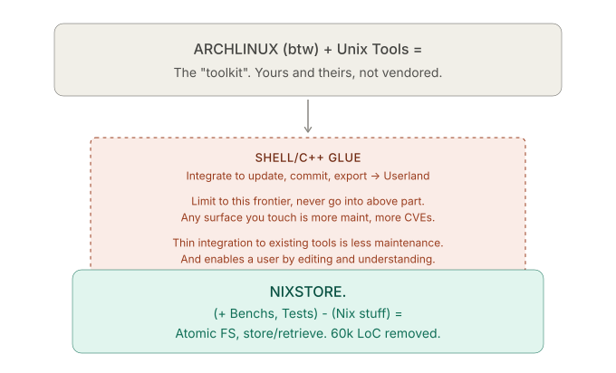
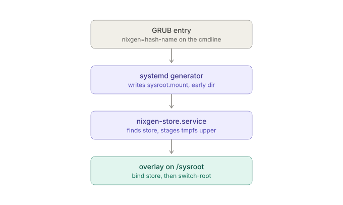
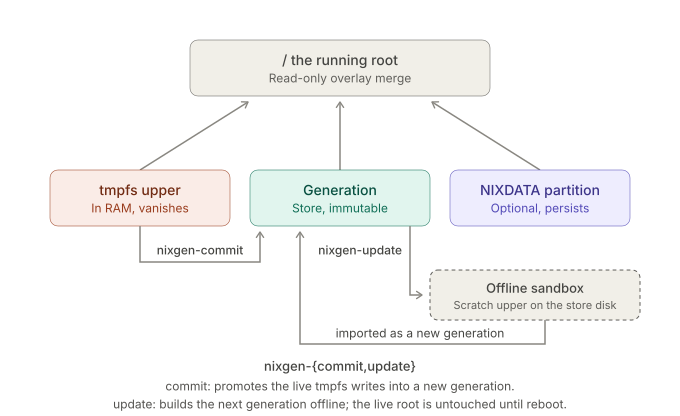

# arch/: Arch Linux generations on the nix store layer

Root filesystem = an immutable, content-addressed generation in a nix
store. GRUB picks the generation, the initramfs overlay-mounts it with a
tmpfs upper and switch_roots in. Rollback = boot an older entry.

Why: pacman live updates replace `/usr/lib/modules` under the running
kernel (module tree effectively unloaded until reboot). Here an update
builds the *next* generation offline; the running root is never touched.

It also aims to solve partial updates in a way, since the current gen;
only lives in RAM and `checkupdates` equivalent is ran before `nixgen-update`.



This was generally the idea (like having `git` through changes you make on system).

Yet for the current to vanish when nothing to `-commit`:


> My goal was for trying new stuff inside a box to be "forgiving".
> But also be more deliberate about what you do carry into a system.

Deps inside the box (installed by [`setup-boot.sh`](./iso/setup-boot.sh))

+ Actual [`nixgen-setup`](./nixgen/nixgen-setup)

## Resources

- https://wiki.archlinux.org/title/File_permissions_and_attributes

## Tools

| script | role |
|---|---|
| `bootstrap.sh <store-root>` | Arch bootstrap tarball → keyring → import as `arch-base` (prints the base path) |
| `import-dir <store-root> <name> <dir>` | commit any tree as a generation + dedup |
| `generation.sh <store-root> <base> <name> [cmd]` | mutate base in an overlay sandbox, import result as new generation |
| `enter.sh <base> [cmd]` | same sandbox, throwaway: writes evaporate |
| `rm-path <store-root> <basename>...` | delete generations, disk + db via GC; refuses referenced paths, prunes orphaned `.links`. Never `rm -rf` inside a store |
| `export-path <store-root> <basename>... > bundle` | stream generations as NAR + path + references; re-hashes against the db so local corruption cannot spread |
| `import-path <store-root> < bundle` | receive a bundle on another machine + dedup; recomputes the CA store path from the received bytes, refuses mismatches |
| `iso/mkiso.sh <store-root> <base>` | bootable ISO: squashed store + GRUB entry per generation |
| `iso/mkstoredisk.sh [img] [size] [fs]` | blank store disk (label NIXSTORE); attached, it persists committed generations |
| `uefi-vm.sh [fresh\|keep\|boot\|iso\|clean]` | interactive QEMU on the real UEFI path (OVMF pflash, persistent NVRAM). Argless = the install workflow: ISO + one blank disk, `nixgen-setup /dev/vda`, then `boot` runs the result. `iso` swaps the blank disk for the NIXSTORE store disk (commit/update playground) |
| `devup.sh` | in-place box update of `nixgen-*` scripts. Usually when changes are small enough |

## Tests

| script | role |
|---|---|
| `tests/boot-test.sh` | headless QEMU smoke-boot of the ISO, PASS on autologin |
| `tests/update-test.sh` | e2e: kernel upgrade in the box, boot the result from the store disk alone |
| `tests/meta-test.sh` | host-only: user created in the sandbox survives manifest + restmeta replay |
| `tests/fs-test.sh` | host-only: every filesystem in the table formats, labels and passes its own read-only check |
| `tests/diskless-test.sh` | ISO with no store disk: boots promptly (nothing waits for absent hardware) and refuses commit/update/remove |
| `tests/isohunt-test.sh` | ISO hunt with the by-label shortcut broken: finds the medium past a decoy disk, without probe-by-mounting noise |

### Boot flow

initramfs is systemd-init (`HOOKS=(base systemd keyboard
block nixgen)`). `nixgen-store.service` takes the generation named by
`nixgen=` from the store disk (label NIXSTORE) when it holds it, else
from `nixstore.squashfs` on the ISO, and stages the tmpfs upper; a
generator writes the `sysroot.mount` that overlays them, so the root
filesystem is a unit like any other; `nixgen-bind.service` exposes the
store at `/nixstore` and the store-disk root at `/nixstoredev` before
switch-root. See [NOTES](./docs/NOTES.md) for more details.



Networking is baked in (networkd DHCP on `en*`, resolved DNS).

### State

Three categories. Committed content is the generation and rolls back
with it. Uncommitted writes live in the RAM upper and vanish. Paths
listed in `/etc/nixgen/state` (default `/home`, `/var/log`) can ride a
real partition instead: `nixgen-data /dev/sdXn` formats and seeds it
(label NIXDATA), `nixdata=NIXDATA` on a GRUB entry's linux line mounts
it, commit's non-recursive snapshot excludes it, so that state flows
forward across generations instead of branching with them. Fully
opt-in: no flag or no disk means volatile as before, per entry.
`/var/lib/pacman` stays committed on purpose: the package db describes
the static tree.

### Motivations

Scope note: this is the nix *store* layer (interference-free, deduped,
GC-rooted, atomic rollback), not the nix *language* layer. Generations
are content-addressed snapshots, not reproducible builds from
derivations. **It is not meant to be used with `nix` pkg-manager or env.**

The idea is that simplicity in arch packaging and philosophy already ship;
a minimalist enough base, if you follow a little the stuff you use...

An arch package in it's original shape is a derivation of a [Pkgfile](https://crux.nu/doc/handbook.html#Pkgfile)
Some 20+ years later this system is still what allows people to patch, port, create.
Similar to [APKBUILD](https://wiki.alpinelinux.org/wiki/APKBUILD_Reference). With generated meta-data files.
In essence, just the package definition is a shell script you can read, **not a manifest in a DSL.**
What was missing from this flow is reproducibility; or an `undo` button in this case.
Failed states are essentially free to throw away. That doesn't guarantee forward churn...
The forward state is not guaranteed, immutable is in my opinion even more valuable on rolling for this exact reason.

### Login

Autologin only while root is passwordless (stock state,
what the headless tests ride on). `passwd root` restores login prompts,
but the password lives in the tmpfs upper like any write: commit it,
or the next boot is passwordless autologin again.

## Real hardware (UEFI only)

### From releases: [ISO](https://github.com/h8d13/archinix/releases)

Write the ISO to a stick (`dd if=build/nixarch.iso of=/dev/sdX bs=4M
oflag=direct status=progress`), boot it on the target, shape the system,
then install what you are running:

```
nixgen-setup /dev/nvme0n1 my-install --fs btrfs
```

GPT (ESP + NIXSTORE), a standalone GRUB whose whole job is sourcing
`entries.cfg` from the store partition, and a first generation committed
from the running root. It refuses to run until the device path is typed
back; everything on the target is lost. `--fs` picks the store
filesystem; run it with no arguments to list them. `--data 20G` adds a
NIXDATA partition on the same disk and installs persistent from the
first boot (see State above).

## VM-testing

Dry-run the whole thing first: `arch/uefi-vm.sh` (argless) boots the ISO
with a single blank disk at `/dev/vda`, exactly the shape of the real
thing, and `arch/uefi-vm.sh boot` starts the result alone afterwards.

The store disk is never attached on that path: an installed target has
its own NIXSTORE partition, and two of them makes GRUB's label search
ambiguous.

### From source:

From the repo root.

```shell
./build.sh                                       # store libs into build/prefix
arch/bootstrap.sh build/archstore                # base generation (prints <base>)
arch/iso/mkiso.sh build/archstore <base>         # bootable ISO
arch/uefi-vm.sh                                  # QEMU (UEFI): ISO + one blank disk
#   in the box: nixgen-setup /dev/vda my-install [--fs btrfs]
arch/uefi-vm.sh boot                             # boot what you installed
```


